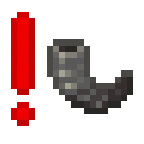

<h1 align="center">
   
  Horny Alert
</h1>

 

This is a simple, client-only utility mod that alerts you of where nearby goat horns are blown.
Goat horns have a hard limited range of 256 blocks, so you will get an alert for any blown goat horns in this range.

_This includes horns blown outside of render distance, which you can't actually hear!_

### _Showcasing to be added..._
